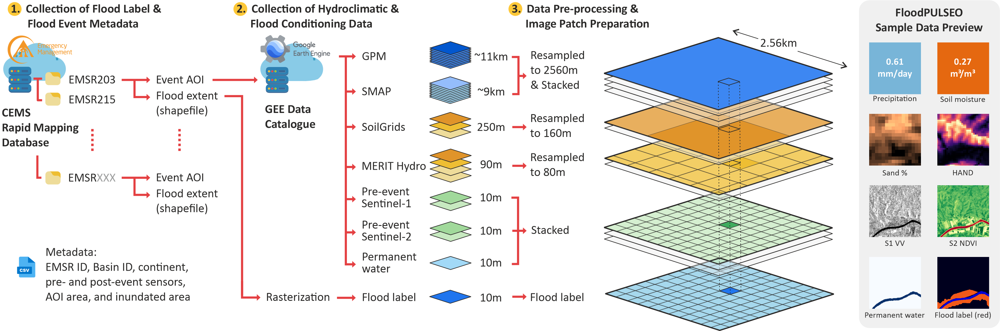
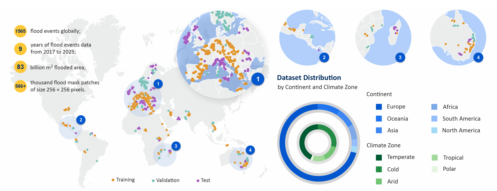

# FloodPULSEO

**A global, multi-resolution dataset for flood prediction from pre-event conditions.**

FloodPULSEO is a machine-learning-ready dataset that pairs **566,669** co-registered image patches with observed flood extents from **1,565** Copernicus Emergency Management Service (CEMS) flood events, drawn from **190** rapid-mapping activations between April 2017 and December 2025 and spanning **283** river basins, six continents, and all five Köppen climate zones.



### Input layers

| Layer | Source | Native resolution | Bands |
|---|---|---|---|
| Sentinel-1 SAR | `COPERNICUS/S1_GRD` | 10 m | VV, VH |
| Sentinel-2 indices | `COPERNICUS/S2_SR_HARMONIZED` | 10 m | NDVI, NDBI |
| MERIT Hydro | `MERIT/Hydro/v1_0_1` | 90 m | elevation, flow direction, UDA, HAND |
| SoilGrids | `OpenLandMap/SOL` | 250 m | clay %, sand % |
| ESA WorldCover | `ESA/WorldCover/v200` | 10 m | permanent-water mask |
| Precipitation | `NASA/GPM_L3/IMERG_V07` | ~11 km | 30 daily (mm/day) |
| Soil moisture | `NASA/SMAP/SPL4SMGP/008` | ~9 km | 30 daily (m³/m³) |
| Flood label | CEMS flood extent (`event.shp`) | 10 m | inundation mask (1 = flooded) |

Every input precedes the flood, so the dataset poses flood **prediction** from antecedent conditions rather than post-event mapping. It is released as patch tiles with the train, validation, and test split already assigned, ready to load for model training. The full pipeline that produces the patches is included, so the release can be rebuilt from scratch or extended to new flood activations with a Google Earth Engine account.

**Dataset:** [Zenodo DOI to be added]

---

## Coverage



Events span 2017-2025 across six continents and all five Köppen climate zones, covering **83 billion m²** of observed inundation. Coverage is not uniform: Europe contributes **1,092** of the 1,565 events (69.8%), a consequence of CEMS activation patterns rather than of flood occurrence. Models trained on FloodPULSEO should be evaluated with that imbalance in mind.

---

## Dataset description

The dataset is delivered as patches. Each flood event is cut into square, non-overlapping tiles that each cover a 2.56 km × 2.56 km ground footprint. **One patch is five GeoTIFFs: four input files and one flood-label file.** The four input files hold the layers above, grouped by resolution, and the label file holds the CEMS flood mask.

| File | Bands | Size | Contents |
|---|---|---|---|
| `input_10m.tif` | 5 | 256×256 | S1 VV, S1 VH, NDVI, NDBI, permanent water |
| `input_80m.tif` | 5 | 32×32 | MERIT elevation, flow-dir sin, flow-dir cos, UDA, HAND |
| `input_160m.tif` | 2 | 16×16 | SoilGrids clay %, sand % |
| `input_2560m.tif` | 2N | 1×1 | precipitation (N days), soil moisture (N days) |
| `flood_mask.tif` | 1 | 256×256 | flood label (1 = flooded) |

Only the 10 m layers are kept at their native resolution, as a 256×256 grid. The other layers are resampled so they integrate into a single multi-modal stack: each file covers the same 2.56 km × 2.56 km footprint, sampled to the grid that matches its resolution. Precipitation and soil moisture reduce to one cell per tile, one value per antecedent day, so `input_2560m` holds 2N bands. The released dataset uses 30 antecedent days, giving 60 bands, 30 precipitation days followed by 30 soil-moisture days. The number of days N is configurable in the pipeline (Section below), so a newly prepared dataset can use a different window.

The permanent-water band lets a model tell pre-existing water from new flooding, while the label stays the observed CEMS inundation alone. MERIT flow direction is split into the sine and cosine of its compass angle so the circular variable has no discontinuity.

### Patch index and splits

Every patch is listed in `released_patches_metadata.csv` in the metadata folder, one row per tile. The three split files in the split_global folder, `train_patches.csv`, `val_patches.csv`, and `test_patches.csv`, are the same table filtered by the `split` column, so each can be loaded directly as a training, validation, or test set. The split is exclusive by HydroBASINS Pfafstetter Level-5 basin and by whole event, so no basin and no event crosses the train, validation, and test sets. The released split contains 427,824 patches (75.5%) from 916 events in training, 68,763 (12.1%) from 307 events in validation, and 70,082 (12.4%) from 342 events in test.

A tile is addressed by `(emsr_code, folder_name, patch_number)`, which locate its files on disk, so the CSV references patches relationally rather than by absolute path. The key columns are below.

| Column | Description |
|---|---|
| `patch_index` | global running index over all patches |
| `emsr_code` | Copernicus activation code, e.g. `EMSR203` |
| `folder_name` | event the patch belongs to |
| `patch_number` | index of the tile within its event (the `NNNN` in the filenames) |
| `crs` | coordinate reference system of the tile (per-event UTM zone) |
| `bounds_minx/miny/maxx/maxy` | tile footprint bounds in `crs` units (m) |
| `flood_pixels` | number of flooded pixels in the tile, from the flood mask |
| `flood_fraction` | fraction of the tile that is flooded, 0-1 (`flood_pixels` / 65,536) |
| `basin_id` | HydroBASINS Pfafstetter Level-5 code(s) of the event |
| `continent` | continent of the event |
| `climate` | Köppen-Geiger main class of the event |
| `sensor_resolution_m` | resolution of the sensor used for the delineation (m) |
| `resolution_class` | medium, high, or very-high |
| `split` | train, val, or test |

---

## Building or extending the dataset

The rest of this README documents the open pipeline that builds the dataset from scratch. Use it to reproduce the release or to extend it to newer activations. The pipeline produces the eight per-event layers of the overview table (the seven geospatial layers plus the flood mask) as full-scene GeoTIFFs, Step 4 tiles them into the patches described above, and Step 5 assigns the train, validation, and test split.

The seven geospatial layers are configurable in `scripts/config.py`. `LAYER_TOGGLES` enables or disables each layer, and `N_DAYS_OVERRIDE` sets the daily-series length N for the temporal layers (default 30). New GEE layers can be added by copying a template in `scripts/add_gee_layers.py`. The full-scene files keep their own names: `S1_VV_VH.tif`, `S2_NDVI_NDBI.tif`, `MERIT.tif`, `Soil.tif`, `ESA_WorldCover_PermanentWater.tif`, and the temporal layers carry their antecedent window in the filename, for example `Precipitation_20240714_20240812.tif`. `flood_mask.tif` is produced in Step 3 by rasterizing the CEMS delineation.

Each activation supplies two CEMS vector components: the AOI boundary (`aoi/aoi.shp`) and the flood extent (`flood_extent/event.shp`). Permanent water comes from ESA WorldCover, which covers every event.

---

## Setup

```bash
conda create -n floodpulseo python=3.11
conda activate floodpulseo
pip install -r requirements.txt
```

**GEE authentication (once):**
```bash
earthengine authenticate
```

---

## Pipeline

Two files configure a run, and five numbered scripts execute it in order.

| File | What it does |
|---|---|
| `config.py` | **Edit first.** Enable or disable layers, set the daily-series length N, set the patch size |
| `add_gee_layers.py` | Layer registry. Copy a template here to add a custom GEE layer |
| **1** `_download_activations.py` | Download EMSR flood activations from Copernicus, reorganize into standardized folders |
| **2** `_submit_gee_tasks.py` | Download the enabled layers per activation straight into `data/GEE_exports/` |
| **3** `_gee_output_preprocessing.py` | Rasterize flood masks and permanent water, add continent, climate and area columns, build the catalog |
| **4** `_make_patches.py` | Cut events into model-ready 2.56 km patch tiles |
| **5** `_make_splits.py` | Assign the basin- and event-exclusive train/val/test split |

Step 2 fetches each layer straight into `data/GEE_exports/` in tiled requests, so Step 3 can run as soon as Step 2 finishes. The download runs locally, so the machine stays busy for the length of the batch. Step 3 downloads a continents layer and a Köppen raster on its first run. Step 5 balances by patch count, so it runs after patching.

```bash
conda activate floodpulseo
python scripts/1_download_activations.py
python scripts/2_submit_gee_tasks.py
python scripts/3_gee_output_preprocessing.py
python scripts/4_make_patches.py
python scripts/5_make_splits.py
```

---

## Data layout

```
data/
  activations/
    activations_raw/          raw Copernicus downloads
    activations_reorganized/  standardized shapefiles (aoi/, flood_extent/)
  GEE_exports/
    {EMSR}/{folder_name}/     one folder per activation
      S1_VV_VH.tif                       2 bands  Sentinel-1 VV/VH
      S2_NDVI_NDBI.tif                   2 bands  NDVI + NDBI
      MERIT.tif                          4 bands  elevation, flow direction, UDA, HAND
      Soil.tif                           2 bands  clay + sand (SoilGrids)
      ESA_WorldCover_PermanentWater.tif  1 band   permanent water mask (ESA WorldCover)
      Precipitation_{first}_{last}.tif   N bands  GPM-IMERG daily (N days pre-event)
      SoilMoisture_{first}_{last}.tif    N bands  SMAP daily (N days pre-event)
      flood_mask.tif                     1 band   rasterized CEMS flood extent
  patches/
    {EMSR}/{folder_name}/     2.56 km tiles, 5 GeoTIFFs per patch
      patch_NNNN_input_10m.tif      5 bands   256x256  S1 VV, S1 VH, NDVI, NDBI, permanent water
      patch_NNNN_input_80m.tif      5 bands   32x32    MERIT elev, flowdir sin/cos, UDA, HAND
      patch_NNNN_input_160m.tif     2 bands   16x16    clay, sand
      patch_NNNN_input_2560m.tif    2N bands  1x1      precipitation (N days) then soil moisture (N days)
      patch_NNNN_flood_mask.tif     1 band    256x256  CEMS flood label
  metadata/
    1_activation_catalog.csv        activation catalog (Script 1)
    1_activation_status.csv         per-product download + reorganization status (Script 1)
    2_gee_export_status.csv         per-layer GEE export status (Script 2)
    2_composite_registry.csv        S1/S2 composite provenance: acquisition window, cloud threshold, image count (Script 2)
    3_dataset_metadata.csv          events new in the latest run (Script 3)
    released_events_metadata.csv    full accumulated dataset catalog, one row per event (Script 3)
    3_missing_layers_report.csv     missing enabled layers per activation (Script 3)
    released_patches_metadata.csv   one row per patch tile (Script 4; split added in Script 5)
    4_patch_validation_issues.csv   per-patch QC findings (Script 4)
    split_global/
      train_patches.csv             patch index filtered to the train split (Script 5)
      val_patches.csv               patch index filtered to the validation split (Script 5)
      test_patches.csv              patch index filtered to the test split (Script 5)
  plots/
    splits/                         split balance plots (Script 5)
```

---

## Dataset catalog

The released catalog is `released_events_metadata.csv`, one row per event across the whole dataset. Its `folder_name` keys into the patches, GEE_exports, and activations_reorganized folders. An activation sometimes maps the same area on the same date more than once, as a delineation, graded, and flood-extent product. Only one of those events is kept, taking the delineation product first, then graded, then flood extent, and within one product type the version with the larger flooded fraction. A pipeline run does not rewrite it; Step 3 writes only the events new in that run to `3_dataset_metadata.csv` and appends them to the released catalog, so prior events and their assigned splits are preserved. Step 3 fills the continent, climate, aoi_area_km2, and flooded_area_km2 columns, and Step 5 fills the split column.

The columns are below.

| column | description |
|---|---|
| `folder_name` | event folder name |
| `basin_id` | HydroBASINS Pfafstetter Level-5 code(s) |
| `event_sensor` | sensor used for the flood delineation |
| `sensor_resolution_m` | resolution of that sensor (m) |
| `resolution_class` | medium, high, or very-high |
| `continent` | continent of the area of interest |
| `climate` | Köppen-Geiger main class |
| `split` | train, val, or test |
| `aoi_area_km2` | area of interest size (km²) |
| `flooded_area_km2` | area under water (km²) |
| `n_patches` | number of patches cut from the event |

---

## Data sources and credits

Flood labels and event metadata come from the [Copernicus Emergency Management Service Rapid Mapping](https://emergency.copernicus.eu/) service. The satellite and geospatial layers are accessed through [Google Earth Engine](https://earthengine.google.com/): Sentinel-1 and Sentinel-2 (ESA/Copernicus), MERIT Hydro, SoilGrids (OpenLandMap), ESA WorldCover, GPM IMERG and SMAP (NASA). Basin boundaries are HydroBASINS Pfafstetter Level-5, and climate zones follow the Köppen-Geiger classification.

## Citation

A data paper describing FloodPULSEO is in preparation. Until it appears, please cite the Zenodo record.

```
[Zenodo citation to be added]
```

